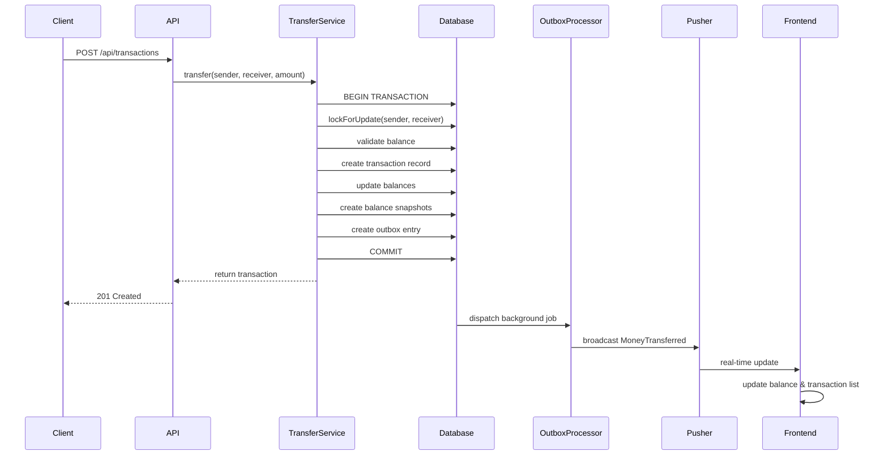

# 🏦 MiniWallet

Welcome to MiniWallet! This is a simple, modern wallet app that lets you transfer money between users, see your balance update instantly, and enjoy peace of mind with safe, reliable transactions.

---

## 🛠️ Tech Stack

### Backend
- **Framework**: Laravel 11.x
- **Language**: PHP 8.3+
- **Database**: MySQL 8.0
- **Queue**: Redis
- **Broadcasting**: Pusher
- **Authentication**: Laravel Sanctum

### Frontend
- **Framework**: Vue 3 (Composition API)
- **Language**: TypeScript
- **Build Tool**: Vite
- **Styling**: Tailwind CSS
- **HTTP Client**: Axios
- **Real-time**: Laravel Echo + Pusher
- **State Management**: Pinia

### Infrastructure
- **Containerization**: Docker + Docker Compose
- **Web Server**: Nginx
- **Process Manager**: Supervisor (manages queue workers, php-fpm, nginx)
- **Queue Backend**: Redis
- **Queue Workers**: Laravel queue workers (2 processes via Supervisor)

---

## 🚀 How to Run the Project

---

> **⚠️ WARNING:**
>
> The included `.env.example` file is already pre-configured with all the necessary settings for fast testing and demo purposes. You can use it as-is to get started quickly, or update secrets, database credentials, and Pusher keys!


## 🚀 Quick Start

### Prerequisites

- Docker & Docker Compose
- Node.js 18+ (for local frontend dev)
- PHP 8.3+ (for local backend dev)

---

### Option 1: One-Step Setup (Recommended)
1. Make the setup script executable:
    ```bash
    chmod +x setup.sh
    ```
2. Run the setup script:
    ```bash
    ./setup.sh
    ```
    This will build everything, check health, and run backend tests for you.

    Here’s what happens step by step:
   
    - `check_dependencies` : Make sure Docker and docker-compose are installed
    - `check_docker_running` : Verify Docker daemon is running
    - `check_port_availability` : Check if required ports (80, 443, 8443, 3306) are free
    - `validate_env_example` : Ensure the backend .env.example file exists
    - `setup_env_file` : Create or update the backend .env file
    - `validate_pusher_config` : Check if Pusher credentials are set (for real-time updates)
    - `stop_existing_containers` : Stop any running containers to avoid conflicts
    - `start_containers` : Build and start all Docker containers (backend, frontend, db, redis, etc.)
    - `wait_for_service "backend"` : Wait for backend service to be healthy
    - `wait_for_service "frontend"` : Wait for frontend service to be healthy
    - `wait_for_service "db"` : Wait for database service to be healthy
    - `wait_for_database` : Make sure the database is ready for connections
    - `run_migrations` : Run Laravel database migrations
    - `seed_database` : Optionally seed the database with sample data
    - `check_queue_worker` : Test that the queue worker is running
    - `health_check` : Run health checks for backend, frontend, and database
    - `verify_installation` : Run installation verification tests and backend test suite
    - `display_setup_summary` : Show a summary of users and transactions
    - `display_info` : Print useful URLs, test user info, and common commands

### Option 2: Docker Compose
1. Start all services:
    ```bash
    docker-compose up -d
    ```
2. Access the app at [https://localhost](https://localhost)

### Option 3: Manual (Advanced)
If you have PHP, Composer, MySQL, Nginx installed:
1. Install backend dependencies:
    ```bash
    cd backend
    composer install
    ```
2. Set up your `.env` file and database.
3. Start the backend (e.g., with `php artisan serve` or configure Nginx).
4. Install frontend dependencies:
    ```bash
    cd frontend
    pnpm install
    pnpm dev
    ```

---

## 🗂️ Project Structure
```
MiniWallet/
├── backend/      # Laravel API & business logic
│   ├── app/
│   │   ├── Http/Controllers/
│   │   ├── Jobs/
│   │   ├── Models/
│   │   │   ├── BalanceSnapshot.php
│   │   │   ├── Transaction.php
│   │   │   ├── TransactionOutbox.php
│   │   │   └── User.php
│   │   ├── Services/
│   │   │   └── TransferService.php
│   ├── tests/
│   │   ├── Feature/
│   │   └── Unit/
│   ├── routes/
│   └── ...
├── frontend/     # Vue 3 client app
│   ├── src/
│   │   ├── views/
│   │   ├── components/
│   │   ├── composables/
│   │   └── ...
│   └── ...
├── infra/        # Docker, Nginx, Supervisor configs
│   ├── backend/
│   ├── frontend/
│   └── mysql/
└── setup.sh      # Automated setup script
```

---

## 🧠 How the Backend Works

MiniWallet is designed for safety, speed, and transparency. Here’s how:

- **BalanceSnapshot**: Every time a transfer happens, we save a snapshot of each user’s balance. This gives you a clear audit trail and makes it easy to track changes over time.
- **TransactionOutbox**: When money moves, we create an outbox entry to make sure real-time notifications are delivered reliably—even if something goes wrong. This helps keep your dashboard up-to-date and ensures you never miss a transaction.
- **Transfers**: Money moves between users in a single, atomic database transaction. We use row-level locks to prevent race conditions, and every transfer is idempotent (so you never get double-charged if you retry).
- **Queue Jobs & Supervisor**: Real-time events and notifications are handled by background jobs. Supervisor keeps these jobs running smoothly, so your app stays fast and responsive.

---

## 💡 Why This Architecture?
- **Safety First**: Atomic transactions and balance snapshots mean your money is always safe and traceable.
- **Real-Time**: Outbox and queue jobs make sure you see updates instantly, with no missed events.
- **Scalable**: The system is ready for more users, more transactions, and future features.

---

## 🙌 Get Started
Try it out, send some money, and watch your balance update in real time.
- [x] User authentication (registration, login, logout) with Sanctum
- [x] Money transfer with commission calculation (1.5% rounded up)
- [x] Transaction history with pagination and filtering
- [x] Real-time balance updates via Pusher
- [x] Balance snapshots before/after transfers
- [x] Dashboard with statistics
- [x] Responsive UI with Vuetify 3

### **Professional Architecture**

| Component | Implementation | Files |
|-----------|---------------|-------|
| **Repository Pattern** | ✅ Complete | `UserRepository`, `TransactionRepository` + Interfaces |
| **Service Layer** | ✅ Complete | `AuthService`, `TransferService` |
| **FormRequests** | ✅ Complete | `TransferRequest`, `ValidateReceiverRequest`, `LoginRequest`, `RegisterRequest` |
| **Thin Controllers** | ✅ Complete | `TransactionController`, `AuthController` |
| **Dependency Injection** | ✅ Complete | All repositories bound in `AppServiceProvider` |

**Architecture Highlights:**
```
Controllers (HTTP Layer)
  ↓
FormRequests (Validation)
  ↓
Services (Business Logic)
  ↓
Repositories (Data Access)
  ↓
Models (Eloquent)
```

### **Async Processing & Queue Workers**
**Implemented Outbox Pattern with Queue Workers:**

| Component | Status | Description |
|-----------|--------|-------------|
| **Outbox Pattern** | ✅ Complete | Transaction events stored in `transaction_outbox` table |
| **Queue Jobs** | ✅ Complete | `ProcessTransactionOutbox` job with retry logic |
| **Supervisor** | ✅ Complete | Manages 2 Laravel queue worker processes |
| **Docker Integration** | ✅ Complete | Dedicated `queue-worker` service + backend supervisor |
| **Retry Mechanism** | ✅ Complete | 5 attempts with exponential backoff |
| **Event Broadcasting** | ✅ Complete | Pusher integration after DB commit |

**Queue Worker Architecture:**
```
Transfer → Create Outbox Entry → DB Commit
                ↓
    Dispatch ProcessTransactionOutbox Job
                ↓
        Redis Queue (events, default)
                ↓
    Laravel Queue Workers (via Supervisor)
                ↓
        Broadcast to Pusher
                ↓
    Mark Outbox as Processed/Failed
```


### 🎯 **Current State: Production-Ready MVP**

**What's Working:**
- ✅ Full money transfer flow with atomic transactions
- ✅ Pessimistic locking prevents race conditions
- ✅ Idempotency keys prevent duplicate transfers
- ✅ Async event processing with queue workers
- ✅ Real-time UI updates via Pusher
- ✅ Comprehensive error handling and retry logic
- ✅ Professional Laravel architecture
- ✅ Dockerized deployment

**What's Next ( Enhancements):**
- [ ] Add Laravel Horizon for visual queue monitoring
- [ ] Implement balance reconciliation job
- [ ] Add Prometheus metrics for monitoring
- [ ] Implement dead letter queue for permanently failed jobs
- [ ] Add Slack/email alerts for failed jobs
- [ ] Performance optimization with Redis caching
- [ ] Add comprehensive feature tests for queue workers
- [ ] Transaction history pagination

---

## 🏗️ Architecture

### System Design Pattern: **Transactional Outbox**


---

## ⚙️ Queue Workers & Async Processing

### Why Queue Workers?

The Mini Wallet uses **queue workers** to process events asynchronously after database commits, ensuring:

1. **Reliability**: Events only fire after successful DB transaction commits
2. **Performance**: Transfer API responds immediately, broadcasting happens in background
3. **Retry Logic**: Failed broadcasts automatically retry with exponential backoff
4. **Scalability**: Multiple worker processes handle concurrent event processing

### Architecture: Outbox Pattern

```
┌─────────────┐
│   Client    │
└──────┬──────┘
       │ POST /api/transactions
       ▼
┌─────────────┐
│ Transaction │
│ Controller  │
└──────┬──────┘
       │
       ▼
┌─────────────┐     ┌──────────────┐
│  Transfer   │────>│   Database   │
│   Service   │     │              │
└──────┬──────┘     │ • Transaction│
       │            │ • Balances   │
       │            │ • Outbox     │
       │            └──────────────┘
       │ DB::afterCommit()
       ▼
┌─────────────────┐
│ Dispatch Job    │
│ ProcessTrans... │
└────────┬────────┘
         │
         ▼
┌─────────────────┐
│  Redis Queue    │
│ (events,default)│
└────────┬────────┘
         │
         ▼
┌─────────────────┐
│ Queue Workers   │
│ (via Supervisor)│
│ • 2 processes   │
│ • Auto-restart  │
└────────┬────────┘
         │
         ▼
┌─────────────────┐
│ Broadcast Event │
│ to Pusher       │
└────────┬────────┘
         │
         ▼
┌─────────────────┐
│ Mark Outbox     │
│ as 'processed'  │
└─────────────────┘
```


### Managing Queue Workers

```bash
# Check worker status
docker exec miniwallet_backend supervisorctl status

# Restart workers after code changes
docker exec miniwallet_backend supervisorctl restart laravel-worker:*

# View worker logs
docker-compose logs queue-worker -f

# Check queue depth
docker exec miniwallet_backend php artisan queue:monitor

# List failed jobs
docker exec miniwallet_backend php artisan queue:failed

# Retry failed jobs
docker exec miniwallet_backend php artisan queue:retry all
```

---


## 📡 API Documentation

### Authentication

```bash
POST /api/login
Content-Type: application/json

{
  "email": "user@example.com",
  "password": "password"
}

# Response
{
  "token": "1|abc123...",
  "user": { "id": 1, "email": "user@example.com" }
}
```

### Transfer Money

```bash
POST /api/transactions
Authorization: Bearer {token}
Idempotency-Key: {unique-key}
Content-Type: application/json

{
  "receiver_id": 2,
  "amount": 10000  # $100.00 in cents
}

# Success (201)
{
  "uuid": "550e8400-e29b-41d4-a716-446655440000",
  "amount": 10000,
  "commission": 150,  # $1.50 (1.5% rounded UP)
  "sender_balance": 89850,
  "receiver_balance": 10000,
  "created_at": "2024-01-15T10:30:00Z"
}

# Insufficient Funds (422)
{
  "error": "Insufficient funds. Required: 10150, Available: 5000"
}

# Duplicate Transaction (409)
{
  "uuid": "550e8400-e29b-41d4-a716-446655440000",
  "message": "Transaction already processed"
}
```

---
